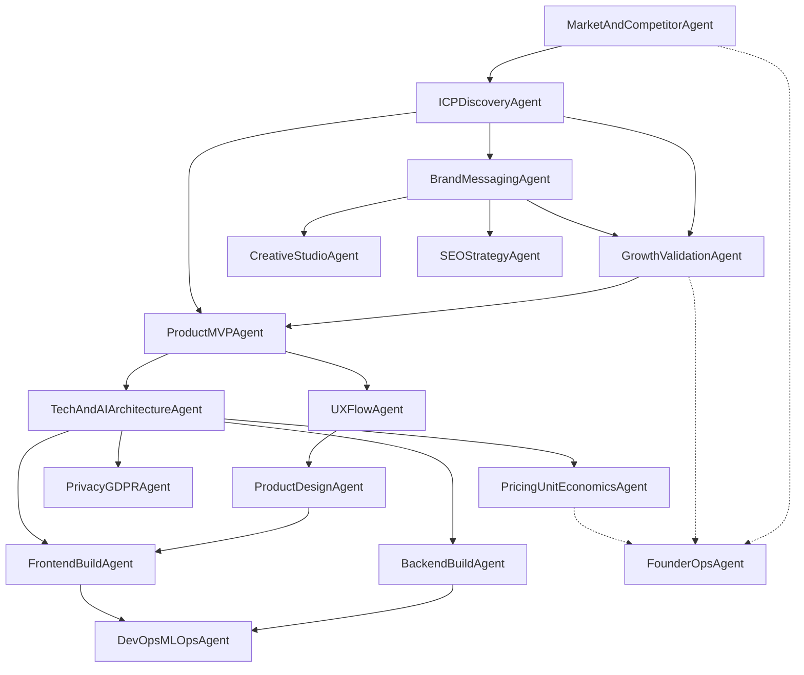

# Agent Role Coverage Matrix

## Required Functions vs Agent Coverage

| Required Function | Agents | Status |
|---|---|---|
| Product manager | MasterDecisionAgent, ProductMVPAgent, FounderOpsAgent | Covered |
| Product designer | UXFlowAgent (flows), ProductDesignAgent (screens/specs) | Covered |
| Marketing / Growth / UA / SEO | GrowthValidationAgent, BrandMessagingAgent, SEOStrategyAgent | Covered |
| Creative/media for acquisition | CreativeStudioAgent | Covered |
| Front-end developer | FrontendBuildAgent | Covered |
| Back-end developer | BackendBuildAgent | Covered |
| DevOps + AI ops | TechAndAIArchitectureAgent (design), DevOpsMLOpsAgent (execution) | Covered |
| Lawyer | PrivacyGDPRAgent + external legal review checkpoint | Covered (with human gate) |

## Agent Dependency Graph

Agents must run in dependency order. An agent cannot produce reliable output without the inputs from its upstream dependencies.

### Reading the graph
- Solid arrows = hard dependency (upstream output is required input).
- Dotted arrows = informational dependency (useful but not blocking).

## Activation Phases

| Phase | Week | Active Agents |
|-------|------|---------------|
| Signal discovery | 1 | MarketAndCompetitor, ICPDiscovery, BrandMessaging, GrowthValidation, CreativeStudio, FounderOps |
| Demand confirmation | 2 | GrowthValidation, BrandMessaging, CreativeStudio, SEOStrategy, PricingUnitEconomics, FounderOps |
| MVP scoping | 3 | ProductMVP, UXFlow, FounderOps |
| Architecture + compliance | 4 | TechAndAIArchitecture, PrivacyGDPR, PricingUnitEconomics, ProductDesign, FounderOps |
| Pilot build | 5-6 | FrontendBuild, BackendBuild, DevOpsMLOps, FounderOps |

## Legal Note
- PrivacyGDPRAgent provides risk analysis and checklists.
- Final legal compliance artifacts (terms, privacy policy, DPA) require qualified legal counsel before public launch.
